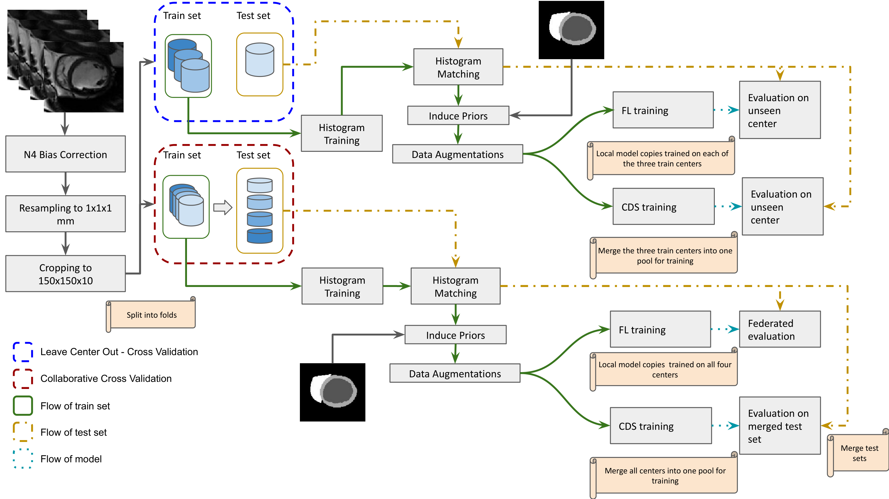

# Federated HCM diagnosis
A study in multi-center imaging diagnostics, emphasizing on the modality of cardiovascular magnetic resonance and the prediction of hypertrophic cardiomyopathy.

## Pipeline


## Code Outline
```
Linardos/federated-HCM-diagnosis
├── README.md   <-- You are here 📌
└── src
    ├── ...    
    └── classification    
        ├── ...   
        ├── train.py               <-- Brings everything together, includes functions that run federated simulation. Some of the data curation occurs here.
        ├── config.yaml            <-- Here you may set parameters, paths to your data, and paths to miscellaneous files that are used by the data loader
        ├── data_loader.py         <-- Loads from ACDC and MnM datasets depending on which centers are asked in the config.yaml
        ├── generate_experiment.py <-- Generates a new experiment in the experiments folder, automatically named according to the set of parameters passed.
        ├── Dockerfile             <-- List of instructions from which to build a docker image.*
        ├── environment.yaml       <-- List of pip and conda installations, used by Dockerfile to instantiate an environment
        └── models    
            └── nets.py    <-- Want to try new models? Add them here, but don't forget to specify them in the config.yaml as well.
```

*Why Docker? A docker image is a microcosm of the dependencies and software used to run this study. By generating disposable environments on runtime you are less likely to run into dependency problems or CUDA version incompatibilities among other things.


## Usage
Make changes in config.yaml to set your own parameters or model. Use the generate_experiment.py script and note that beside src there will be a new folder named experiments. Each experiment will receive a tag that is a 4 digit number attached to a name you defined. All files from classification will be copied to that folder, so that you have an instance of your experiment which you can then run using the Dockerfile. In code this would be:
```shell
python generate_experiment.py
cd </path/to/your/experiment>
docker build -t experiment .
docker run -v </path/to/datasets>:/root/Datasets -v </path/to/your/experiment>:/experiment experiment
```

## Improving upon the Federated CMR diagnostics
If your goal is to study other models or multi-label classification in a federated set-up, add your model in the nets.py and/or configure config.yaml accordingly

## Adapting to another problem
You may adapt this set-up to another diagnostics (or possibly segmentation) problem by tampering with the following files included in the src/classification: config.yaml, models/nets.py, data_loader.py
